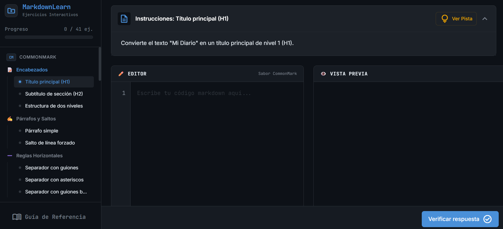
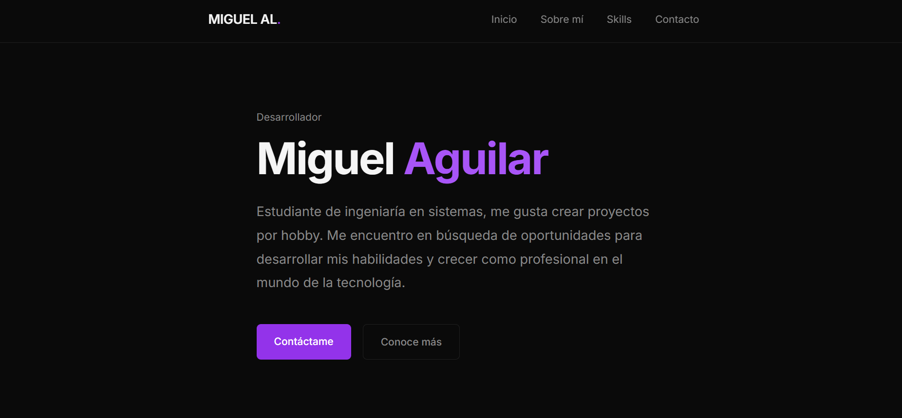

<!--README PERFIL-->

# 👋 Hola, mi nombre es Miguel Aguilar!

### 👨‍💻 Sobre mi

Actualmente estoy estudiando la carrera de Ingeniería en Sistemas Computacionales en el Instituo Tecnológico de Veracruz. Me interesa la programación y el desarrollo de aplicaciones web. Me consideero una persona proactiva, responsable y con muchas ganas de aprender.

---

### 🚀 Habilidades

#### Lenguajes de programación:

    

#### Frontend:

     

#### Backend:  

  

#### Herramientas y otros:

   

---

### 🔨 Proyectos

- Sakura Learning: Una aplicación web para aprender japonés, desarrollada con React, Tailwind CSS y Firebase. [Ver proyecto](https://sakura-learning-seven.vercel.app/)

- Markdown Learn: Una aplicación web para aprender Markdown, desarrollada con React, Tailwind CSS y Next.js. [Ver proyecto](https://markdown-learn.vercel.app/)

- Portafolio: Mi portafolio personal, desarrollado con HTML y CSS. [Ver proyecto](miguelaguilar.dev)

---

### 🎓 Educación

Actualmente estoy cursando la carrera de Ingeniería en Sistemas Computacionales en el Instituto Tecnológico de Veracruz. Además, he tomado cursos en línea sobre desarrollo web, programación y tecnologías emergentes.

---

###  Intereses

Aparte del mundo de la programación, me interesa mucho la música y el aprendizaje de idiomas. Actualmente estoy aprendiendo japonés y me gusta tocar la guitarra en mi tiempo libre.

---

### Contacto

- Correo electrónico: mikeal2123495@gmail.com
- Página web: [miguelaguilar.dev](miguelaguilar.dev)

